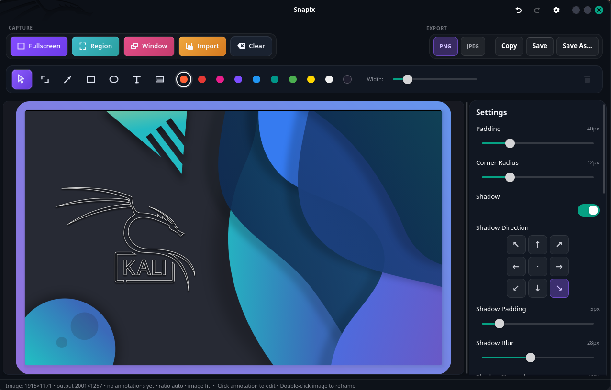

# Snapix

> Screenshot tool for Linux with fast annotation and polished exports. Native GTK4, Wayland-first.

[](https://github.com/khanhnv2901/snapix/actions/workflows/ci.yml)
[](LICENSE)


## Current Status

- Latest tagged release: `0.1.0` (2026-04-22)
- Active milestone: `M4 Packaging Prep` (Flathub submission, distribution setup, final QA)
- Execution status source: [PROGRESS.md](PROGRESS.md)
- Release history: [CHANGELOG.md](CHANGELOG.md)

## Overview

Snapix is a native Linux screenshot editor built with GTK4 and libadwaita. It is designed for the common workflow of taking a screenshot, marking it up quickly, and exporting something that already looks presentable without extra editing in another app.

Main capabilities:

- Capture fullscreen, region, or active window
- Annotate with crop, arrow, rectangle, ellipse, text, and blur
- Beautify screenshots with gradients, solid backgrounds, padding, rounded corners, and shadows
- Export to PNG/JPG or copy directly to the clipboard
- Run as a GUI app or from the command line for scripted capture flows

## Quick Demo



1. Build the release binary with `cargo build --release`.
2. Launch the editor with `./target/release/snapix`.
3. Capture a screenshot, add annotations, then use Quick Save or Export.
4. For CLI capture, run `./target/release/snapix capture --mode full --output screenshot.png`.

## Build And Run

### Requirements

You need:

- Rust and Cargo
- GTK4 development packages
- libadwaita development packages
- GLib development packages
- X11 development packages
- `pkg-config`

Ubuntu/Debian:

```bash
sudo apt-get install \
  libgtk-4-dev libadwaita-1-dev libglib2.0-dev \
  libx11-dev libxrandr-dev pkg-config \
  cargo
```

Fedora:

```bash
sudo dnf install \
  gtk4-devel libadwaita-devel glib2-devel \
  libX11-devel libXrandr-devel pkgconf-pkg-config \
  cargo
```

Arch Linux:

```bash
sudo pacman -S \
  gtk4 libadwaita glib2 libx11 libxrandr \
  pkgconf cargo
```

### Clone And Build

```bash
git clone https://github.com/khanhnv2901/snapix
cd snapix
cargo build --release
```

### Run The GUI

From the repo:

```bash
cargo run --release --bin snapix
```

Or run the built binary directly:

```bash
./target/release/snapix
```

### Run CLI Capture

Fullscreen:

```bash
./target/release/snapix capture --mode full --output screenshot.png
```

Explicit region on X11:

```bash
./target/release/snapix capture \
  --mode region \
  --x 100 --y 80 --width 1280 --height 720 \
  --output region.png
```

Active window on X11:

```bash
./target/release/snapix capture --mode window --output window.png
```

Wayland notes:

- CLI region capture can use the XDG portal picker when bounds are not provided.
- CLI window capture is not reliable on Wayland; use the GUI for that flow.

### Install Locally

If you want `snapix` available on your shell path:

```bash
cargo install --path crates/snapix-app
```

## Project Structure

```text
snapix/
├── crates/
│   ├── snapix-core/      # Domain logic (canvas, entitlements, license)
│   ├── snapix-capture/   # Screenshot backends (X11, Wayland portal)
│   ├── snapix-ui/        # GTK4 + libadwaita UI
│   └── snapix-app/       # CLI + binary entry point
├── data/                 # Desktop files, icons, metainfo
└── flatpak/              # Flatpak build manifest
```

For Flatpak/Flathub packaging, see [flatpak/io.github.snapix.Snapix.yml](flatpak/io.github.snapix.Snapix.yml). The main repo stays lightweight for normal Cargo builds; Flathub should provide Cargo sources separately via `cargo-sources.json`.

Release notes are tracked in [CHANGELOG.md](CHANGELOG.md).

Tagged releases can ship a prebuilt AppImage through GitHub Releases for users who prefer download-and-run installs.

## License

Apache-2.0 © 2026 Khanh Nguyen
